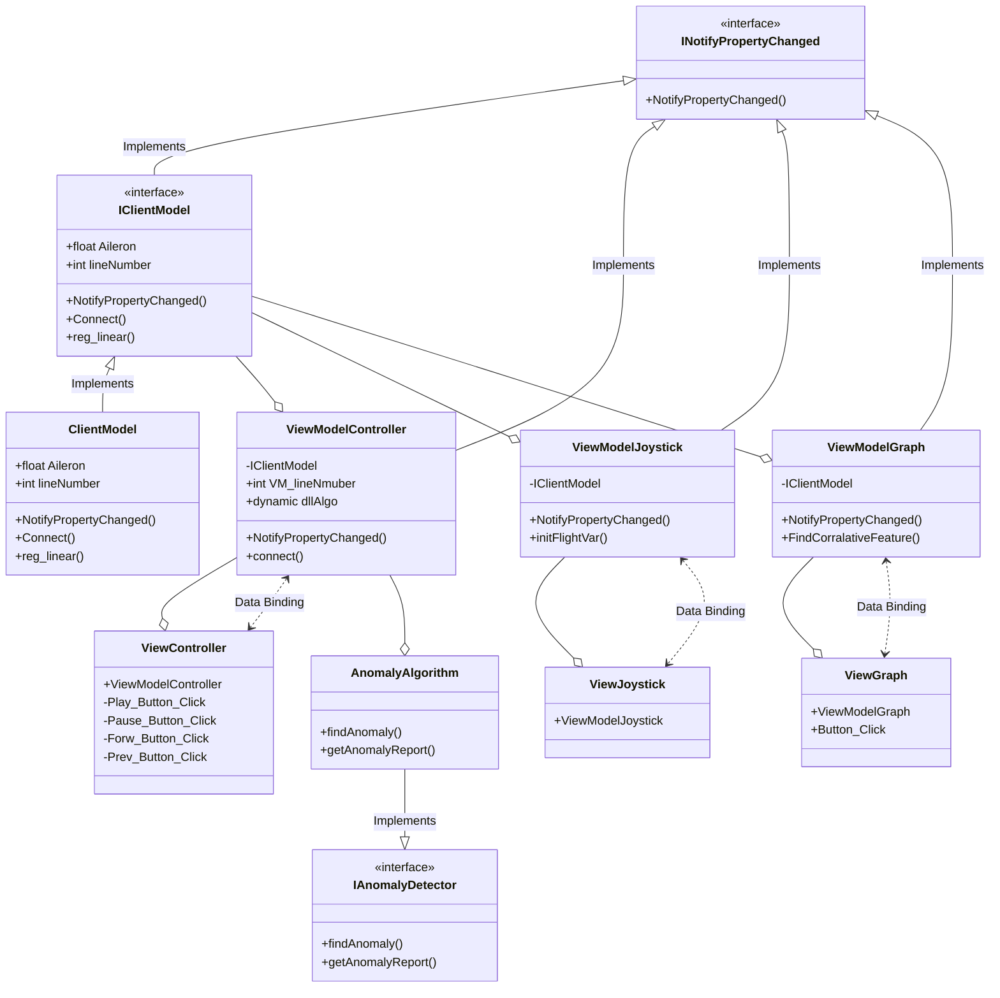

# DesktopFGApp

Our App (DesktopFGApp) is made especially for pilots and flight researchers that want to explore flights. The app getting CSV file with flight data, and XML (with headers for CSV file and other information that will be used late in FlightGear app) - according to CSV and XML data FG will project flight on its window. Our app (will display on a separate window from the FG app) provides the following features - 
 - **Time Control** - Mainwindow contain time control buttons and a slider that will allow the user to control flight time.
 
 - **Picture of the Steers** - From the main window user can open the steers window which shows you steer picture for the current time in the flight. Among steers features you can find - joystick, aileron, elevator, yaw, pitch, and etc.
 
 - **Data Display** - From the main window user can open the data display window which allows him to choose one of the attributes of the flight. According to the chosen attribute, the user will see a graph that displays the value of this attribute during the flight. Users will also see the most correlative attributes display on a separate graph. 
 The third graph will display a correlation graph for the attributes above. All of the graphs display real-time data (meaning live data is streaming into the graphs as the flight is playing). 
 
 - **Anomaly Algorithm** - From the main window user can dynamically load the anomaly algorithm before or during the flight. The algorithm will be used by our app only if the DLL file implements the "IAnomalyDetector" interface. After detecting anomalies in current flight data - the user can see where anomalies happen in the main window slider (anomaly time will be display as ticks under the slider). Users can also find which attributes are in the anomaly report in the data display - the attributes button will be in red. In the correlation graph in the data display window - anomalies will be shown as blue points in the graph. 
## Directory hierarchy
**Model**:
 - **ClientModel** -  open a TCP connection and sending data using this connection. In our case, the server is the FG app. Every data that send properties that change notifies the observers (View Model).
 
 **View Model**:
- **ViewModelController** - controls the play speed, and sending notifies to the ViewController (MainWindow) of changes.
- **ViewModelJoystick** - calculates the position of the flight variables and notify the JoystickView.
- **GraphViewModel** - user choose an attribute from a list. ViewModel finds taking the chosen feature and finds the most correlated attributes in data. Display different graph for every attributes and also their regression line. Data is updated in real-time. 

**View**:
- **MainWindow** - display the time management. From this window, the user can open all of the other views.
- **JoystickView** - display the position of the joystick and steers variables.
- **GraphView** - display the different graphs as described above.

**Plugins**:
- **miniCircleDLL (c#)** -  detects anomalies by finding min circle, uses extern functions from minCircleDll.
- **minCircleDll (c++)** - algoritem to detect anomalies by min Circle that we implemented in the previous semester.
- **simpeliAnomalyDLL (c#)** - detects anomalies by finding regression line, uses extern functions from simpeleAnomalyDLL.
- **simpeleAnomalyDLL (c++)** - algoritem to detect anomalies by regression line that we implemented in the previous semester.
## Shortened UML

## Installation
Before running our app you need to download and install the FlightGear application - you can find [download link here](https://www.flightgear.org/download/). For more information about FlightGear, you can find [here](https://www.flightgear.org/) 
You will also need .Net Framework version 4.6.1 and up. You can find download [link here](https://dotnet.microsoft.com/download/dotnet-framework). 
## Run application

 - **For Devlopers** - 
 - **For Users** - 

## Documentation
Here you can find a Link to UML contains partial information of the central classes and about the DLL. UML represents the various connections between the classes and the most important information found in each class. UML can be found [here](https://lucid.app/lucidchart/7449e159-4b1b-4645-b7ae-9db34b7f0c98/view?page=0_0#). 
If you are a developer you can find full documentation of functions, variables, and more in the code.
## Video
Link to an explanation video........
